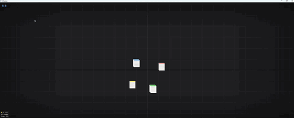

# Scholion

A canvas-style PDF workspace for research and deep reading. Open multiple PDFs, arrange their pages freely on an infinite GPU-accelerated canvas, annotate with highlights, pen strokes, and note flags, and save your entire layout as a project file. A side panel lets you read pages closely and browse all your captured highlights in one place — export them as HTML with a single click.

Designed and built by @ARMMRDN (2026).

---



---

## Platform Status

| Platform | Status |
|----------|--------|
| macOS | Fully functional — universal binary (Apple Silicon + Intel) |
| Windows | Fully functional — x64 MinGW build, bundled DLLs |
| Linux | Functional — x86_64 build (`Scholion-Linux.zip`) |

---

## Features

**Canvas**
- Infinite pan and zoom — arrange pages from multiple PDFs in any layout
- Color-coded document stacks with thread wires connecting related pages
- Tile-based GPU rendering keeps the canvas smooth across 100+ pages at any zoom level
- Event-driven rendering — idle CPU and battery use drop to near zero during long reading sessions (macOS/Linux)
- Page rotation in 90° increments, plus 180° and reset; annotations persist through rotations
- Full-text search (Cmd+F / Ctrl+F) with hit highlights on the canvas and in the sidebar
- Text boxes — drag to size, style with color and font size, with an optional per-box "scale with zoom" so margin notes stay proportional to the page; undo/redo

**Annotations** (applied in the sidebar panel)
- Highlighter — one swipe tool: swipe across text to capture the underlying characters into the References tab; swipe across a figure or blank region to leave a persistent translucent marker
- Freehand pen
- Note flags (A–Z, 2A–2Z…) stamped on pages, visible on canvas and in panel

**Sidebar Panel**
- **Viewer tab** — page-by-page view of the open document with page navigation
- **References tab** — all text highlights from every document collected in one list, exportable as a standalone HTML file
- Open Documents list — toggle thread visibility per document; double-click to reveal in Finder or re-link a missing file
- Edge tabs on the right side of the canvas open the panel without taking up canvas space

**Project Files**
- Save and restore full canvas layouts as `.scholion` JSON files
- Autosave every 60 seconds
- Missing PDFs are kept as placeholders — positions and annotations survive a re-save; re-link when the file is found

---

## Download

Pre-built binaries are on the [Releases](../../releases) page.

| Platform | File |
|----------|------|
| macOS (universal) | `Scholion.dmg` |
| Windows (x64) | `Scholion-Windows.zip` |
| Linux (x86_64) | `Scholion-Linux.zip` |

---

## Building from Source

### macOS

```bash
# One-time dependency
brew install glfw

# Build from repo root
cmake -S scholion -B scholion/build \
  -DCMAKE_BUILD_TYPE=Release \
  -DSCHOLION_WITH_MUPDF=ON
cmake --build scholion/build -j$(sysctl -n hw.ncpu)

open scholion/build/Scholion.app
```

### Windows (MSYS2 / MinGW64)

```bash
# From an MSYS2 MinGW 64-bit shell
cmake -S scholion-win -B scholion-win/build \
  -G Ninja \
  -DCMAKE_BUILD_TYPE=Release \
  -DSCHOLION_WITH_MUPDF=ON
cmake --build scholion-win/build
```

MuPDF static libs must be placed in `scholion-win/third_party/mupdf/lib/` before building. See `scholion-win/CLAUDE.md` for the full setup guide.

---

## Project Structure

```
scholion/           macOS build + all shared cross-platform source
  src/              application logic (main.cpp, renderer.cpp, …)
  include/          public headers
  third_party/      Dear ImGui, MuPDF, tinyfiledialogs
  resources/        AppIcon.icns, Info.plist
scholion-win/       Windows CMake overlay + platform stubs
.github/workflows/  CI/CD (build.yml)
RELEASE_NOTES.md    Release notes — embedded into each CI release
```

All application logic lives in `scholion/src/` and `scholion/include/`. Both platforms compile from the same files; platform differences are handled with `#ifdef __APPLE__` / `#ifdef _WIN32` guards.

---

## CI/CD

A single workflow (`.github/workflows/build.yml`) covers both platforms.

| Trigger | What happens |
|---------|-------------|
| Push to `main` or `develop` | Both platform builds run as a compile check — no release created |
| Version tag (`v*`) | Full sequential build + automatic release |

**Release sequence:** macOS builds first and creates a draft release with the DMG and release notes attached. Windows builds after (`needs: build-macos`) and uploads its zip to that draft. A publish job then makes the release live. No artifact storage is used.

**Cutting a release:**
```bash
# 1. Update RELEASE_NOTES.md, push to main
git push origin main

# 2. Create the version tag via the GitHub API
gh api repos/armmrdn/Scholion/git/refs \
  --method POST \
  --field ref="refs/tags/vX.Y" \
  --field sha="$(gh api repos/armmrdn/Scholion/git/refs/heads/main --jq '.object.sha')"
```

> Once a tag name has been used with a published release, GitHub locks it permanently. Always use a new tag name for each release (e.g. `v1.0`, `v1.1`, `v2.0`).

---

## License

© 2026 ARMMRDN.

This project makes use of open source libraries including Dear ImGui, MuPDF, GLFW, and tinyfiledialogs. Each library retains its own license.
